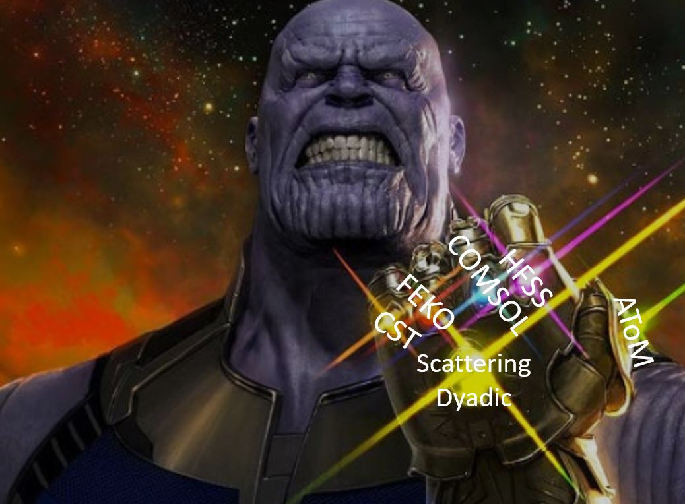
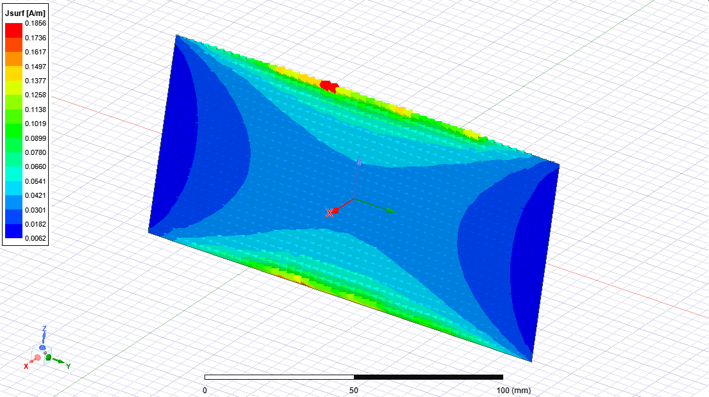
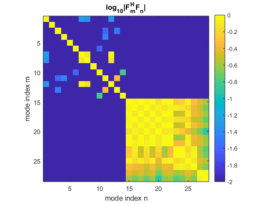
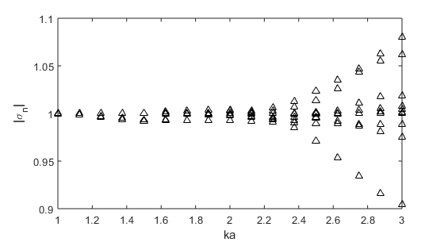

# scattering-dyadic-characteristic-modes



# Table of Contents
- [Overview](#overview)
- [FEM with HFSS](#finite-element-method-with-ansys-hfss)
- [MoM with FEKO](#finite-element-method-and-method-of-moments-with-altair-feko)
- [FDTD with CST](#finite-difference-time-domain-with-cst)
- [FEM with Comsol](#finite-element-method-with-comsol-multiphysics)
- [References](#references)

# Overview

This repository includes wrappers and post-processing routines for calculating characteristic modes in several commercial full-wave solvers.  Examples are based on [[1]](#references).  Brief documentation for codes associated with each solver can be found below, along with the contact information of each code's primary author.  

Note that these codes are intended as demonstrations of the procedures described in [[1]](#references) and are not written as general-purpose tools.  Experiment and modify these codes at your own risk.

These codes are posted as supplemental material to [[1]](#references).  As such, you can cite [[1]](#references) to reference this repository.

# Finite Element Method with Ansys HFSS

Control scripts, pre-calculated data, and template simulation files are provided for computing characteristic modes using Ansys HFSS.  These scripts were developed and tested using Ansys Electronics Desktop 2021 R1.

Scattering dyadic data generation and characteristic mode visualization are implemented via MATLAB scripts which control HFSS via automatically generated IronPython HFSS control scripts.  Two additional MATLAB scripts parse and process previously generated characteristic mode data without requiring HFSS.

Note that, by default, the control scripts in this package utilize non-graphical command line execution of HFSS.  This feature must be enabled within HFSS by checking the "Non Graphical Command Execution'' checkbox in the Tools / Options / General Options / General / Beta Options ... dialog box.

## Contact information

Any issues or questions related these examples can be directed to Kurt Schab, Santa Clara University, USA; kschab[at]scu.edu.

## Pre-calculated scattering dyadic data

Pre-calculated scattering dyadic data are provided for a set of 17 evenly spaced electrical sizes _ka_ between 1 and 3 using 14 Lebedev quadrature points (28 incident plane waves).  These data were used to produce the HFSS FEM data points in Figs. 3 and 4 of [1].

The scripts [hfss02_parseData.m](#hfss02_parsedatam) and [hfss03_calculateCharacteristicModes.m](#hfss03_calculateCharacteristicModesm) can be run using these data without HFSS to compare the corresponding characteristic mode data to an EFIE reference dataset. 

The script [hfss04_visualizeCharacteristicMode.m](#hfss04_visualizeCharacteristicModem) can be run in conjunction with HFSS to visualize characteristic modes using the pre-calculated data.  Screenshots of HFSS visualization of the 10 modes with highest modal significance at _ka_ = 1.5 are saved in the [compiled-data](fem-hfss/compiled-data) directory for reference, see the example figure below.



Note that, at this frequency, the correlation coefficients between characteristic far fields indicates that only modes 1-6, and 9 are reasonably accurate with the selected mesh configuration and Lebedev quadrature order.  Visualization of modes 7, 8, and 9 shows high correlation with low order dipole modes, showing that these modes are not properly numerically resolved.  For reference, correlation data at this frequency using pre-calculated data is stored in [corr-ka-1.5-leb-14.fig](fem-hfss/compiled-data/corr-ka-1.5-leb-14.fig) and displayed below.



The accuracy of the chosen Lebedev and mesh settings is best illustrated by examination of the transformed eigenvalue magnitude _1+2t_n_, which, for lossless scatterers such as the PEC plate, should be equal identically equal to 1.  This study is performed in [hfss03_calculateCharacteristicModes.m](#hfss03_calculateCharacteristicModesm) and reproduced in the figure below.  There it is observed that at small electrical sizes _ka_ < 2.2, the error in this parameter is less than 1%, whereas at larger electrical sizes the error begins to grow substantially.  These errors are expected as at higher frequencies the fixed meshing strategies and limited number of Lebedev quadrature points can no longer accurately model the scattering behavior of the system.



## hfss01_generateData.m

This script uses calls HFSS to obtain scattering dyadic data.  **Execution of this script requires HFSS and can take a significant amount of time.** Precomputed data are provided for users interested in skipping this step and moving straight into post-processing and visualization of characteristic modes.

The settings that should be altered by the user are listed block near the beginning of the script,

```
% user settings
%%%%%%%%%%%%%%%%%%%%%%%%%%%%%%%%%%%%%%%%%%%%%%%%%%%%%%%%%%%%%%%%%%%%%%%%%%
HFSSexe = '"C:\Program Files\AnsysEM\AnsysEM21.1\Win64\ansysedt.exe"';
tag = 'plate-preset';
kalist = linspace(1,3,17);
lebDegree = 6;
guiEnable = 0;
```

Here, `HFSSexe` is the path of the local Ansys Electronics Desktop executable, `tag` is a filename prefix used in saving and loading data, `kalist` is a vector containing the electrical sizes at which data should be collected, and `lebDegree` is the degree of Lebedev quadrature used to construct the scattering dyadic matrix.  The variable `guiEnable` should be set to `0` (no HFSS GUI) or `1` (HFSS GUI).

When run, this script opens a template IronPython script [plateComputeTemplate.py](fem-hfss/hfss/plateComputeTemplate.py), updates the text with prescribed variables, saves the updated text to [plateComputeActive.py](fem-hfss/hfss/plateComputeActive.py), and non-graphically executes the updated script in HFSS using the template file [plate-compute.aedt](fem-hfss/hfss/plate-compute.aedt).  This process is repeated for each electrical size listed in `kalist`.


Scattering data for each electrical size are saved in the [data](fem-hfss/data) directory with filenames following the format 
```
<tag>-ka-<ka>-leb-<lebDegree>.csv.
```

Debugging errors is easiest when the HFSS GUI launch is enabled, or when the active scripts are run manually from within HFSS.  If HFSS is aborted mid-simulation, subsequent runs of the automated routines may not behave as expected.  If this is the case, open the template file directly within HFSS, run a standard simulation of whatever settings were last defined using HFSS / Analyze All, save the template when complete, and retry the automated scripts in MATLAB.

## hfss02_parseData.m

Data generated by [hfss01_generateData.m](#hfss01_generatedatam) are stored in the [data](fem-hfss/data) directory as csv files with HFSS header information.  This script parses these files and produces compiled MATLAB datasets containing multi-frequency scattering dyadic data.

Two settings are located near the beginning of this script
```
% parameters
%%%%%%%%%%%%%%%%%%%%%%%%%%%%%%%%%%%%%%%%%%%%%%%%%%%%%%%%%%%%%%%%%%%%%%%%%%
tag = 'plate-preset';
lebDegree = 6;
```

Here, `tag` is the filename identifier that will be used to search for compatible datasets and `lebDegree` is the degree of Lebedev quadrature to consider.

When run, this script searches for files with names of the format
```
<prefix>-ka-*-leb-<lebDegree>.csv.
```
within the [data](fem-hfss/data) directory.  For each of the located files, the script parses the contained ASCII data into numerical format and constructs the scattering dyadic matrix according to (XX) in [1].  Once all files are parsed, the compiled dataset, consisting of scattering dyadic matrices and frequency data, is stored in the [compiled-data](fem-hfss/compiled-data) directory with the filename
```
<prefix>-leb-<lebDegree>-compiled.mat
```

## hfss03_calculateCharacteristicModes.m

Using data compiled by [hfss02_parseData.m](#hfss02_parsedatam), this script calculates characteristic mode eigenvalues and plots them alongside reference data sets obtained using the impedance matrix EFIE formulation.

Two settings are located near the beginning of this script
```
% parameters
%%%%%%%%%%%%%%%%%%%%%%%%%%%%%%%%%%%%%%%%%%%%%%%%%%%%%%%%%%%%%%%%%%%%%%%%%%
tag = 'plate-preset';
lebDegree = 6;
plotDetailedView = 1;
```

Here, `tag` is the filename identifier that will be used to search for compatible datasets and `lebDegree` is the degree of Lebedev quadrature to consider.  `plotDetailedView` toggles the plotting of scattering dyadic and complex eigenvalue data at each electrical size.

When run, this script searches for a compiled dataset with the filename
```
<prefix>-leb-<lebDegree>-compiled.mat
```
This file is then loaded, and for each frequency in that dataset the characteristic mode eigenvalues _t_n_ are calculated according to (XX) in [1].  The magnitude and phase of these eigenvalues are then overlaid on top of reference EFIE eigenvalue data.

## hfss04_visualizeCharacteristicMode.m

This script utilizes the data compiled by [hfss02_parseData.m](#hfss02_parsedatam) and HFSS to visualize characteristic mode current and field distributions.

Four parameters are listed near the beginning of the script
```
% parameters
%%%%%%%%%%%%%%%%%%%%%%%%%%%%%%%%%%%%%%%%%%%%%%%%%%%%%%%%%%%%%%%%%%%%%%%%%%
tag = 'plate-preset';
lebDegree = 6;
modedex = 1;
kadex = 1;
```
Here, `tag` is the filename identifier that will be used to search for compatible datasets, `lebDegree` is the degree of Lebedev quadrature to consider, `modedex` is the index of characteristic mode to visualize, and `kadex` is the desired frequency index within the compiled dataset.

When run, this script opens the template control script [plateVisualizeTemplate.py](fem-hfss/hfss/plateVisualizeTemplate.py), updates the text with prescribed variables, and saves the updated text to [plateVisualizeActive.py](fem-hfss/hfss/plateVisualizeActive.py).

After [plateVisualizeActive.py](fem-hfss/hfss/plateVisualizeActive.py) has been updated, it can be executed manually using the HFSS template [plate-plotting.aedt](fem-hfss/hfss/plate-plotting.aedt) from within the HFSS GUI via the Tools / Run script... prompt.

If the frequency selected by `kadex` has not been recently simulated within this HFSS file, execution of [plate-plotting.aedt](fem-hfss/hfss/plate-plotting.aedt) includes both solution of the system and generation of the characteristic mode data corresponding to the selected `modedex`.  Because this script is for plotting qualitative figures, adaptive meshes are disabled.  If solution data for the selected `kadex` is already available, the fullwave solution step is skipped and only the characteristic mode data are updated via altered incident excitation weights.

Note that as the frequency or Lebedev degree are altered, the field overlay plots within HFSS may need to be manually updated.

# Finite Element Method and Method of Moments with Altair FEKO

Altair FEKO disposes of several solvers which can be employed to get characteristic modes via decomposition of scattering dyadic. In this package, the following options are shown:
- MoM (PEC obstacles)
- MoM (surface equivalence)
- FEM (combined with MoM radiation boundary condition)

There are several prerequisites to run the FEKO-related part of this package:
1/ Altair FEKO installed in version 2021 or newer,
2/ Altair FEKO added to the system path variables,
3/ MATLAB installed in version 2021b and newer.

To test that all the points are fulfilled, you can easily run Example "Ex0_helloCMA.m". The most common problem is addition of FEKO to the list of system variables. For example, considering Windows OS, locate the PREFEKO and CADFEKO executable files, most probably at "c:\Program Files\Altair\FEKO_xxxx.x\feko\bin" (Win) or /home/user/xxxx.x/altair/feko/bin/ (Linux) and add them as described in the documentation of FEKO.

## Contact information

Any issues or questions related these examples can be directed to Miloslav Capek, CTU in Prague, Czech Republic, miloslav.capek[at]fel.cvut.cz.

## Workflow

The scattering dyadic data are first precalculated via command-line access to FEKO solver. The type of the solver is automatically chosen depending on the model created by the user. Each model is saved as CFM file which is generated by CADFEKO when the FEKO working session is saved. It is necessary that the model contains all geometric details, all domains are associated with a proper solver, and the model is meshed. Media (metallic/dielectric/magnetic) should be introduced via variables (e.g., "dielectric1"), and these variables are later on used in MATLAB wrapper (see below). This package contains several models generated by the author and covering the examples of the paper [1], to which this package serves as the supplementary material.

Once the modal is created and saved, it is recommended to let it run in FEKO to verify that all options are set properly. Once this is done, the MATLAB wrapper has to be set. The best strategy for a new example is to consult the existing ones. The wrapper is called by a simple script, specifying location and name of the model, the name of the files containing the calculated data, and the physical and mathematical constants required for the evaluation. The control variables are described below.

A crucial step is the numerical quadrature used in the Nyström scheme extracting the algebraic representation of the scattering dyadics. For this purpose, Lebedev quadrature is selected for two reasons. First, the number of points required by this quadrature is low as compared to other quadrature rules. This results in significantly faster evaluation. Second, a given degree of Lebedev quadrature guarantees certain number of spherical waves are integrated exactly. This establishes link to transition matrix decomposition (represented in spherical waves), for which the estimate of how many spherical waves for a given frequency is required. As a results, we can estimate the degree of Lebedev quadrature.

## Control variables

Model (MATLAB variable "model"):
Variable specifies the path to the FEKO model and its name. This FEKO model (CFM extension) is used afterwards with the wrapper to extract the scattering dyadic matrices.

Frequency (MATLAB variable "k0"):
Frequency range is given in terms of (vacuum) wavenumbers.

Materials (MATLAB variable "Materials"):
The MATLAB cell "Materials" contains a list of all used materials in the FEKO model. The naming has to be the same as in the CFM file. The cell is structures as multiple lines, each line representing one material as {name_of_material, epr_r, diel_tan_delta, mu_r, mag_tan_delta}. If the materials is purely electric (dielectric), it is defined as {name_of_material, epr_r, diel_tan_delta, [], []}.

Degree of quadrature (MATLAB variable "nDegree"):
Among others, the precision of the simulation is controlled by the density of the spatial discretization of the model, which is set in FEKO while preparing the CFM model, and by specifying the quadrature rule over the unit sphere used to algebraically approximate the spherical dyadic. For Lebedev quadrature, the available degrees are listed in bin.getLebedevSphere and/or bin.getLebedevDegrees. Higher degree means generally more modes of higher precision, however, at the cost of computational time linearly increasing with the degree of the quadrature. For particular case of Lebedev, the numerical value of a degree multiplied by two gives the number of plane wave excitations used for the evaluation. The degree has to be in accordance with the estimate (23) of [1] to provide reasonably precise data. For the details, see [1] and documentation of functions bin.getLebedevDegrees and bin.getLebedevSphere.

## Control variables (optional)

The following control variables are at lines 1-4 in "feko_sd.m" and can be edited if needed.

batchLength (integer): controls how many frequency points are evaluated in one (potentially parallelized) FEKO batch. By default, batchLength = 20 (maximum number of student license).

deleteAuxFiles (logical value): decides whether all the auxiliary files created by the wrapper are during the evaluation and at its end. By default, deleteAuxfiles = true.

preFEKOfileName (char/string): provides the prefix for naming of all the FEKO files created by the wrapper. By default, preFEKOfilaName = 'characteristicModeEvaluation'

storeTempData (logical value): provides information to the wrapper whether the most time consuming data (columns of scattering dyadic) should be saved during the evaluation. This provides an useful backup if something goes wrong. By default, storeTempData = true

## Examples

Examples are chosen according the paper [1]. Any of the following examples can be opened in MATLAB and directly called by pressing "F5" (i.e., running the script).

1/ Ex0 - PEC plate (single frequency, poor meshing and quadrature degree)

This example serves as a test that all is running properly, please start with this script.

2/ Ex1 - PEC plate

Example from Section IV.A of [1]. PEC plate of aspect ratio 1:2 evaluated in ka = [0.7, 2.9], where k is the wavenumber and a is the radius of the smallest sphere circumscribing the plate.

3/ Ex2A - rim with GND

Example from Section IV.B of [1]. It is a PEC rim with capacitive ground plane, the dimensions of which are described in [1]. Since only PEC is used, standard MoM is utilized as the solver. The rim is studied in ka = [0.7, 2.9] range.

4/ Ex2B - rim with GND and bulk of dielectric

The same example as Ex2A with a dielectric block placed inside the rim. The dimensions are described in [1]. The solver used in this case is surface equivalence, but FEM-MoM hybrid can be utilized as well.

5/ Ex3A - Layered dielectric sphere

Example from Section IV.C of [1]. It is a sphere (a ball) of radius a, made of four layers of the same thickness. The permittivity is epr_r = {3,5,8,2} (from the most inner to the most outer layer). The spherical shell is studied in ka = [0.5, 4]. The used solver is FEM with MoM radiation boundary condition (it is not needed to discretize the surrounding region and aply ABC/PML). Using the fine mesh grid, the calculation takes tens of hours.

6/ Ex3B - Layered dielectric-magnetic sphere

The same example as Ex3A, the layers are, however, made either of dielectric or magnetic material. The permittivity is epr_r = {1,5,1,2} and the permeability is nu_r = {3,1,8,1} (from the most inner to the most outer layer). Using the fine mesh grid, the calculation takes tens of hours.

Notice that the quadrature degree and discretization used are for demonstration purposes only. The precise results requires in some cases higher degree of finer mesh grid!

## Structure of the package

The package is composed of several parts.

The folder "models" contains FEKO CFM models used as the examples. Other models, created by the users, can be added there.

The naming space +bin contains routines used for multiple purposes (conversion from carthesian to spherical coordinates, standardized color list, physical constants, functions for Lebedev quadrature, scattering dyadic decomposition, and far-field tracking of characteristic modes).

The naming space +feko contains the core functionality establishing link to FEKO solvers, automatically generating PREFEKO scripts, running them, and extracting data (mainly far-fields and current densities) from POSTFEKO files. It is not necessary to modify anything inside this package as there are two main scripts communicating with the naming spaces +bin and +feko.

Script feko_sd.m is called by the examples created by the user (see the list above). The script feko_sd.m assemble all the input data and calls +feko routines to extract the scattering dyadics data.

Script feko_cm.m is called when other characteristic quantities than far field have to be recovered. For examples, the characteristic current densities are recovered by this script by generating PREFEKO file utilizing plane wave sources according Fn characteristic vector.

For the detailed documentation, see the individual files.

# Finite Difference Time Domain with CST
The commercial solver CST Studio Suite 2022 is used to demonstrate the technique in finite-difference time-domain (FDTD). The following describes the automated script integration using MATLAB and the ActiveX framework to send commands to CST used in [1]. Note that the codes are not written for efficiency, but rather for clarity. There are several additional tweaks and settings one can implement and modifications of the scripts to suit your needs should be straightforward.

The code package consists of two paths: 

Main.m -- the main example which generates the geometry and settings based on user input. The data is then generated, processed, and plotted without saving intermediate steps.

The second path consists of:

CST_GenerateData.m -- Loads a CST file and sets up the file based on the user settings. Data (Electric field etc.) is saved.

CST_ProcessData.m -- With the saved data from the previous step it is processed and saved as tn values.

CST_PlotData.m -- Plots tn and alpha plots based on the saved data from the previous step.

See each file for more detailed comments.

If there is an issue with the CST files. Try resaving them in your version, deleting any results and excitations, and keeping only the geometry.

The codes were developed using CST Studio Suite 2022 and have been tested for the 2022 and 2021 versions of the program. All the data in [1] referring to FDTD and CST used a version of the included code.

## Contact Information
Any issues or questions related to these examples can be directed to Johan Lundgren, Lund University in Lund, Sweden, johan.lundgren[at]eit.lth.se.

## Control Variables
The user needs to specify settings relating to the technique, frequencies, and mesh. These are found in the first 50 rows of Main.m and CST_GenerateData.m. The important settings are:

nLebedev: The number of Lebedev points, see [1] and previous sections.

a: the radius of the smallest circumscribing sphere around the object of interest (in mm)

npulses: The maximal number of pulses CST should send at a specific excitation.

Mesh settings include the self-evident CellsPerWavelength, NearCellsPerWavelength, FarCellsPerWavelength, and MinimumCell.

## Main 
The purpose of this file is to have a single press-play ready file. It runs two different examples, a 2:1 aspect ratio PEC plate which is generated using script commands, and a dielectric/magnetic sphere (same as in [1]) which is loaded from a CST file included in this code package. The default settings of mesh and number of Lebedev points are present to have a "short" simulation time (minutes). No data is saved in this script.

## CST_GenerateData
The main file is essentially split up into three separate parts where CST_GenerateData is the first step. This file reads an existing CST file with geometry and creates the model based on user input of mesh, frequency, and Lebedev settings. The main part of the script is a for-loop over all the excitations (2 x the number of Lebedev points, one for each polarization). The real and imaginary parts of the scattered electric field in the frequency domain are saved for all Lebedev points. These are then saved along with a scalar, the number of Lebedev points, two vectors the frequency values (fss), and the corresponding ka values. 

For higher values of Lebedev points and extracted frequency values, the E_scat variable is larger than 2 GB and must be saved in a MATLAB version over 7.3. 

## CST_ProcessData
The second script in the series begins by loading the data generated in the previous script, CST_GenerateData.m. The scattering dyadic is assembled by converting the scattered electric field values (far-field probes are defined at a certain position in CST, hence scattered electric field) in the x-y-z directions for each Lebedev point, to the far field (theta and phi direction).

The tn values are computed using the Lebedev weights and MATLAB's eig function. As opposed to other numerical techniques, FDTD obtains frequency sampling for "free" in the interval of interest. The tracking included is based on correlation. Each eigenvector at frequency f_n is compared to and mapped with, the eigenvectors at frequency f_(n+1). The second for-loop in the script caries out the sorting and only allows for an eigenvector to be mapped to once.

The sorted tn values are then saved along with the projection on the circle (a more stable way to obtain alpha angles for smaller tn). As in the previous script the number of Lebedev points, and two vectors the frequency values (fss), and the corresponding ka values are also saved.  

## CST_PlotData
The final script in the series plots the modal significance and alpha angles for the number of modes (plotmodes) given. A threshold is set such that any mode which abs(tn)<0.05 is not plotted. Further, if the magnitude of tn is lower than 0.0005 the data point is set to not a number to avoid vertical lines in the alpha plot (rapid changes from pi/2 to 3pi/2)

## Modifications and Alterations
Other characteristic quantities could also be obtained such as the currents. The codes can be modified for this purpose by adding H-field probes at the regions of interest and subtracting the values with that of a reference simulation setting all material to vacuum. Current probes are not recommended and can yield unphysical results.

The code used the finite integration technique (FIT) which is an FDTD-based code. However, it can also be altered to use the frequency domain solver in CST by changing the solver called. Other settings than those listed in the code will then also be added or altered, such as meshing.

## Auxilliary and Assisting Files
Supporting files in the Bin folder:

carth2sph -- Converts far-field values in different directions from a cartesian coordinate system to a spherical coordinate system.

CstDefineTimedomainSolver -- Script which starts a time-domain simulation in CST.

CstExportFarProbeTXT -- Script which extracts real and imaginary data for all defined electric field probes in CST and saves them in a txt file.

CstFarProbe -- Script to create an electric far-field probe in CST at a given position.

CstPlaneWave -- Scripts which sets the excitation plane wave in CST.

getLebedevSphere -- Copyright (c) 2010, Robert Parrish, The Sherrill Group, CCMST Georgia Tech. Computes normalized points and weights for Lebedev quadratures on the surface of the unit sphere at double precision. Available at Mathworks. 

pointstoE -- Simple script to retrieve the theta and phi directions for a coordinate. Used to obtain the excitation polarizations at each Lebedev point.

ReadCSTFileFar -- Script which parses the txt file generated by CstExportFarProbeTXT.

completionbar -- loading bar in ASCII-style. Purely a cosmetic function.

time2str -- Converts seconds to a string of days/hours/minutes/seconds. A cosmetic function used to print time remaining.


# Finite Element Method with Comsol Multiphysics

In the case of Comsol Multiphysics, the electromagnetic model is supposed to be build in Comsol environment. The evaluation of scattering dyadic is then performed in MATLAB using MATLAB LiveLink feature in Comsol and using scattering formulation in the RF module. The scripts assume the use of excitation defined using MATLAB function. To enable this feature, the use of MATLAB functions must be enabled in "Comsol --> Preferences --> Security: Allow external libraries, Allow external Matlab functions". Post-processing steps are performed in MATLAB. The scripts were tested in Comsol 6.0 and MATLAB 2020a.
Paths "COMSOL60\Multiphysics\mli", "FEM_Comsol" and their subdirectories must be in Matlab paths.

## Contact information
Questions related these examples can be addressed to Lukas Jelinek, Czech Technical University in Prague, lukas.jelinek[at]fel.cvut.cz.

## Generic Workflow
It is assumed that electromagnetic model is already build (*.mph file is available) including the MATLAB-based excitation in the RF module and that scattering formulation is used. In the case of evaluating scattering dyadic, the excitations are planewaves which are defined using MATLAB function "EiPW.m". Spatial derivatives of the incident field are defined in MATLAB functions "DkxEiPW.m, DkyEiPW.m, DkzEiPW.m". These functions must be introduced in the Comsol environment under the "Global definitions --> MATLAB", see the example for more details.
Prior to running the main script ("No02_getSdyadComsol.m"), the link between Matlab and Comsol must be opened using "No00_startComsolServer.m, No01_connectComsol.m". This turns on the Comsol server and initializes the LiveLink connection.

The evaluation of scattering dyadic ("No02_getSdyadComsol.m") is based on repetitive call of a loop in which the excitation is chosen by parameters "n0x, n0y, n0z, e0x, e0y, e0z" and the scattered electric field "Es" is evaluated. In each loop, the scattered field is sampled at Lebedev’s points on a sphere and from this data, the scattered far field is evaluated using function "projectEsTof.m". After filling the entire scattering dyadic for all incident directions and polarizations, the data are structured into its final form (see Eq. (21) of [1]).
Subsequent steps are the eigenvalue decomposition (see Eq. (20) of [1]) and mode tracking which are performed by script "No04_getCMdata.m". Tracked modal data can be plotted using "No05_plotTrackedResults.m"

## Example
The example based on Comsol file "PECpatchPWMatlab.mph" replicates the Comsol data from Fig. 3 and 4 of [1]. The evaluation uses Lebedev’s quadrature rule with 26 points at lowest frequency. In total, 52 excitations are therefore performed for lowest frequency samples and this number increases with electric size according to Eq. (23) of [1]. Since the evaluations is time consuming, the results are also saved in "\FEM_Comsol\results". These precalculated results can be loaded to "No04_getCMdata.m" scipt.

## Characteristic modes defined using transition matrix
In an analogous manner to scattering dyadic, characteristic modes can be evaluated using transition matrix (see Eq. (XX) of [1] and (XX) of [2])). In the case of Comsol environment, the evaluation of transition matrix follows similar workflow to the evaluation of scattering dyadic discussed above. The excitation via spherical vector waves is defined using MATAB functions "EiSW.m, DkxEiSW.m, DkyEiSW.m, DkzEiSW.m". 
The evaluation of transition matrix ("No02_getTmatComsol.m") is based on repetitive call of a loop in which the excitation is chosen by parameter "SWindex" and the scattered electric field "Es" is evaluated. In each loop the scattered field is sampled at Lebedev’s points on a sphere and from this data, the scattered far field is evaluated using function "projectEsTof.m".

Evaluation of characteristic mode data, tracking and plotting is provided by "No04_getCMdata.m" and "No05_plotTrackedResults.m".

## Converters
The folder "FEM_Comsol" in its name space "+utilities" also contains several convertor tools transforming scattering dyadic to transition matrix ("getTfromSdyad.m") and vice versa ("getSdyadFromT.m") or transforming far fields into spherical vector wave expansion ("getFSWfromF.m") and vice versa ("getFfromFSW.m"). Since the number of spherical waves (for transition matrix) or plane waves (for scattering dyadic) to obtain satisfactory precision in characteristic decomposition depends on the scattering object, the fastest of the two should be chosen for particular scenario and the above converters can then be used to transform the results into one of the bases (plane waves or vector spherical waves).


# References

[1] xxxx, Characteristic Mode Decomposition Using the Scattering Dyadic in Arbitrary Full-Wave Solvers, submitted to IEEE Trans. AP, arxiv: xxxx
